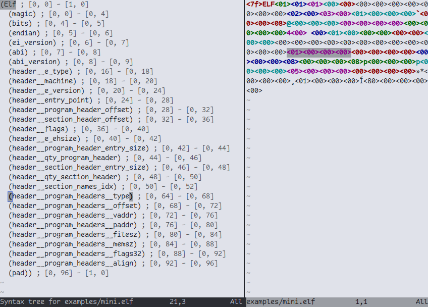
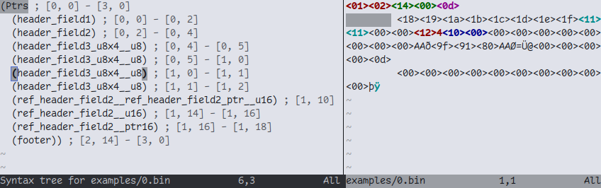

# Bin-sitter

Binaries are just spicy text. They should be handled nicely by text editors.

So here's Neovim syntax highlighting an ELF executable file:



## Wait, is that really Tree-sitter?

Yes! Bin-sitter takes a generated Kaitai Struct parser, then parses it to generate a Tree-sitter grammar, from which tree-sitter-cli generates the parser used by tree-sitting text editors.

## Poke it

Use the provided Neovim config (replace `~/code/my/bin-sitter` inside the config by the path where this project was checkout):
```sh
cp ./examples/nvim/init.lua ~/.config/nvim/
```

Setup symlinks for query highlights:
```sh
mkdir -p ~/.config/nvim/queries/elf
ln -s ./tree-sitter-elf/src/highlights.scm ~/.config/nvim/queries/elf/
```

Run the server, which receives data files to be parsed, using the given Kaitai Struct parser:
```sh
./emitter.py ./kaitai/elf.py --server
```

Run Neovim, which sends the given data file to the server, and receives the offsets to be highlighted. Let's also render the parsed token tree after opening the file:
```sh
nvim -c InspectTree examples/mini.elf.bin
```

## Another one

We can add support for a new binary format `foo` with file extension `.bar`, given a Kaitai Struct source file `foo.ksy`.

Generate the Kaitai Struct parser:

```sh
./kaitai-struct-compiler-0.11/bin/kaitai-struct-compiler \
    -t python \
    --debug \
    --python-package . \
    ./foo.ksy
```

Generate the Tree-sitter grammar template:

```sh
mkdir ./tree-sitter-foo/
cd ./tree-sitter-foo/
tree-sitter init
```

Generate the Tree-sitter grammar from the Kaitai Struct parser (an example file is required for sanity checking emitted grammar rules):

```sh
./emitter.py ./kaitai/foo.py \
    --data-path ./examples/foo.bar \
    --update-path ./tree-sitter-foo/ \
    --file-type bar
```

Generate the Tree-sitter parser:

```sh
cd ./tree-sitter-foo/
tree-sitter generate
```

Configure this parser on Neovim, under `~/.config/nvim/init.lua`:

```diff
@@ -7,6 +7,7 @@

 vim.filetype.add({
   pattern = {
+    ['.*.bar'] = 'bar',
     ['.*.bin'] = 'bin',
     ['.*.elf'] = 'elf',
   },
@@ -41,6 +42,15 @@
 })

 local parser_config = require("nvim-treesitter.parsers").get_parser_configs()
+parser_config.foo = {
+    install_info = {
+        url = "$BIN_SITTER_PATH/tree-sitter-foo",
+        files = { "src/parser.c", "src/scanner.c" },
+        generate_requires_npm = false,
+        requires_generate_from_grammar = false,
+    },
+    filetype = "bar",
+}
 parser_config.ptrs = {
     install_info = {
         url = "~/code/my/bin-sitter/tree-sitter-ptrs",
@@ -61,7 +71,7 @@
 }

 vim.api.nvim_create_autocmd({ 'BufReadPost', 'CursorMoved', }, {
-  pattern = { "*.bin", "*.elf" },
+  pattern = { "*.bar", "*.bin", "*.elf" },
   callback = function()
     vim.api.nvim_set_hl(0, 'SpecialKey', { })
   end,
```

Setup symlinks for query highlights:

```sh
mkdir -p ~/.config/nvim/queries/foo
ln -s ./tree-sitter-foo/src/highlights.scm ~/.config/nvim/queries/foo/
```

Install this parser on Neovim:

```sh
nvim -c TSInstall foo -c q
```

On future changes to this parser:

```sh
nvim -c TSUpdateSync -c q
```

## How it kinda works

Binary formats require more expressive parsing than the usual plain text of source code. For example, a given token might be encoding an absolute or relative offset to some other token, which could be positioned earlier than the current token being scanned. We quickly bump into a wall if we only consume tokens sequentially.

### Flattening tokens

Tree-sitter scanner's default behaviour can be overridden by instead delegating tokenisation to [External Scanners](https://tree-sitter.github.io/tree-sitter/creating-parsers/4-external-scanners.html).

In Bin-sitter, all scanning is done with externals, which means we can't nest rules. Consequently, our parsed tree becomes more like a parsed list.

This project includes a custom format `ptrs` that serves as a minimal example to exercise binary formats' scanning requirements. If we want to have a sub-field `u8` as part of `header_field3_u8x4`:

```js
externals: ($) => [$.footer, $.header_field1, $.header_field2, $.header_field3_u8x4, $.u8, $._pad, $._err],
rules: {
    Ptrs: $ => repeat(seq(
        optional($._pad),
        choice($.footer, $.header_field1, $.header_field2, $.header_field3_u8x4))),
    header_field3_u8x4: $ => repeat(seq(
        optional($._pad),
        choice($.u8))), }
```

Well, we don't:

```
Error: Error when generating parser
Caused by:
    Rule 'header_field3_u8x4' cannot be used as both an external token and a non-terminal rule
```

So what we end up emitting at any given position is a flattened token, such as `header_field3_u8x4__u8`.

An alternative to this approach might be possible via [language injection](https://www.jonashietala.se/blog/2024/03/19/lets_create_a_tree-sitter_grammar/#Language-injection). But this seems to increase complexity by having a separate grammar for at least each nesting level the binary format requires. While we get separate scanners, and produce an actual tree, it seems we would still be limited by parsing the tree incrementally...

### Encodings

Most binary formats require parsing at byte-level. Therefore, if we use some typical encoding like UTF-8, a single code point might be encoded with multiple bytes. In these cases, the external scanner can't emit two distinct tokens in-between those bytes.

While Tree-sitter supports [custom decode functions](https://github.com/tree-sitter/tree-sitter/pull/3833), this is limited to the rust bindings (at the time of writing), and there is no requirement that our text editors use those particular bindings.

Luckily, it seems that configuring Neovim to open files in latin-1 encoding was enough to scan one byte at a time.

## TODO

- Custom encoding based on latin-1, to avoid rendering whitespace for parsed tokens:
    - 
- Prevent newline inserted at end of text being sent to tree-sitter scanner, as this breaks positioning of footer tokens (they will consume the extra newline);
- Show name of parsed token on cursor hover (which is not the highlight group exposed by `vim.inspect(vim.treesitter.get_captures_at_cursor(0))`);

## Acks

- [emitter.py](./emitter.py) AST for Kaitai Struct parsers was modified from [PolyFile](https://github.com/trailofbits/polyfile), under [LICENSE.polyfile](./LICENSE.polyfile);
- Other files under [LICENSE](./LICENSE);
